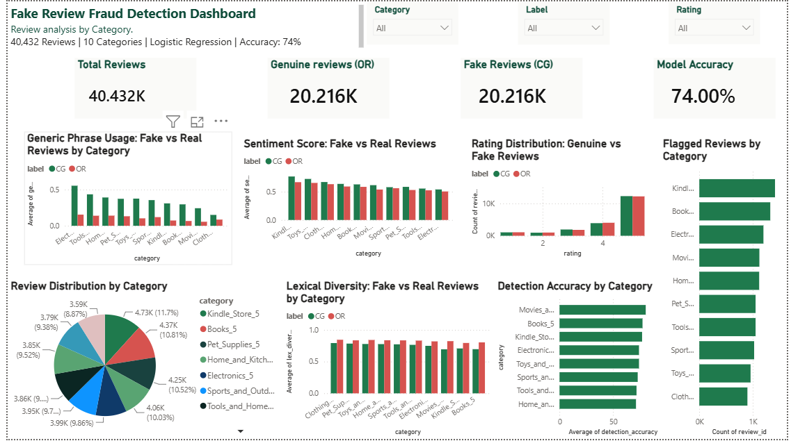

# Fake Review Fraud Detector

An NLP and machine learning project that detects AI-generated (fake) e-commerce product reviews by identifying linguistic "fingerprints" that distinguish them from genuine human-written reviews — and surfaces which product categories are most vulnerable to undetected fakes.

---

## Overview

E-commerce platforms are increasingly flooded with AI-generated fake reviews designed to inflate product ratings. This project investigates whether fake reviews leave measurable, detectable patterns in their language — and builds two complementary detection approaches around those patterns.

**Dataset:** [Fake Reviews Dataset](https://www.kaggle.com/datasets/mexwell/fake-reviews-dataset) — 40,432 Amazon product reviews across 10 categories, perfectly balanced between computer-generated (CG) and original/real (OR) reviews.

---

## Two Models, Two Questions

### Model 1 — TF-IDF Logistic Regression (High Accuracy)
> *"Can a computer tell fake from real using raw text?"*

- Converts raw review text directly into TF-IDF vectors
- Logistic Regression trained on those vectors
- **Accuracy: ~90%**
- High accuracy but largely black-box — hard to explain *why* a review is flagged

### Model 2 — Engineered Feature Classifier (Explainable)
> *"What specifically makes fake reviews sound different from real ones?"*

- Five hand-crafted linguistic fingerprint features per review
- Logistic Regression trained on those features
- **Accuracy: 74% (71% recall on fake reviews)**
- Lower accuracy, but every decision is explainable and actionable

Both models are included in the notebook. The engineered-feature model is the main focus of this project because it answers the more interesting, business-relevant question.

---

## Linguistic Fingerprints (Model 2 Features)

| Feature | Fake (CG) | Real (OR) | Insight |
|---|---|---|---|
| Sentiment score | 0.635 | 0.582 | Fake reviews are more uniformly positive |
| Adjective ratio | 9.5% | 8.5% | Fake reviews use more describing words |
| Noun ratio | 18.0% | 20.4% | Real reviews name more specific things |
| Lexical diversity | 0.750 | 0.825 | Real reviews use a wider vocabulary |
| Generic phrases / review | 0.348 | 0.107 | Fake reviews use stock phrases ~3x more |

**Strongest signals:** lexical diversity (model weight: −13.26) and generic phrase count (1.02) — validated on the full 40,432-row dataset.

---

## Category Vulnerability Analysis

Per-category models reveal which product categories are easiest/hardest to detect fakes in:

| Category | Detection Accuracy |
|---|---|
| Movies & TV | 80.5% — easiest |
| Books | 77.5% |
| Kindle Store | 77.1% |
| Electronics | 74.2% |
| Toys & Games | 74.2% |
| Sports & Outdoors | 73.0% |
| Tools & Home Improvement | 71.9% |
| Home & Kitchen | 71.4% |
| Pet Supplies | 70.9% |
| Clothing & Jewelry | 68.2% — hardest |

Content-based categories (Movies, Books) are easiest to flag — real reviews reference specific plot points and details that fake text can't convincingly replicate. Commodity categories (Clothing, Pet Supplies) are hardest — even genuine reviews tend to be short and generic.

---

## Fraud Risk Score

Used the engineered-feature model's predicted probabilities as a per-review fraud risk score (0–1):

- **Mean score for fake reviews (CG): 0.647**
- **Mean score for real reviews (OR): 0.355**

At a 0.7 threshold, 22–30% of reviews per category are flagged, with average confidence of 0.82–0.87 among flagged reviews.

---

## Dashboard

Interactive Power BI dashboard with category, rating, and label filters — showing generic phrase usage, lexical diversity, rating distribution, category vulnerability ranking, and flagged review counts.

---

## Tech Stack

- **Python** — pandas, NLTK, scikit-learn
- **NLP** — VADER sentiment, POS tagging, TF-IDF, lexical diversity (TTR)
- **SQL** — SQLite for aggregation and flagging queries
- **Power BI** — interactive dashboard

---

## Key Insight

Fake reviews leave measurable traces — most strongly in vocabulary repetition and generic phrasing. Detection difficulty varies sharply by category, making a one-size-fits-all threshold insufficient for real-world deployment.

## Future Work

- Implement deep learning models (LSTM, BERT) for improved accuracy
- Deploy as a web app using Streamlit for real-time review scoring
- Add reviewer-behavior signals (posting velocity, account age) using timestamp data

---

**Author:** Navya M — BCA, CMR University | [LinkedIn](https://linkedin.com/in/navya1063)
